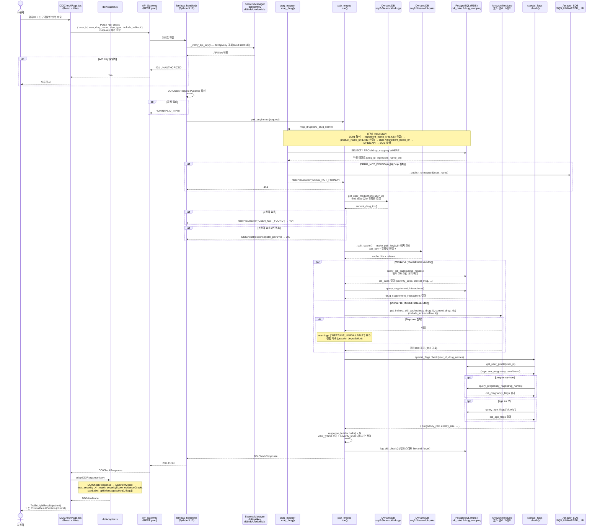

# DDI Checker — 아키텍처 다이어그램
> 최종 업데이트: 2026-05-04  
> 실제 코드에서 추출. **미구현** 항목은 `%% 미구현:` 주석으로 표시.

---

## 다이어그램 1. 전체 시스템 아키텍처 (Sequence)



---

## 다이어그램 2. 데이터 흐름 (Flowchart)

```mermaid
flowchart TD
    START([사용자 제출\nuser_id + new_drug_name]) --> APICALL[POST /ddi-check\napi/ddi.ts checkDDI]

    APICALL --> AUTHCHECK{API Key\n검증}
    AUTHCHECK -->|실패| E401[401 UNAUTHORIZED\n오류 배너 표시]
    AUTHCHECK -->|성공| PARSE[DDICheckRequest\nPydantic 파싱]

    PARSE -->|파싱 실패| E400[400 INVALID_INPUT]
    PARSE -->|성공| MAPDRG[drug_mapper.map_drug\nnew_drug_name 해소]

    MAPDRG --> STEP1{drug_id\n형식?}
    STEP1 -->|D001 형식| FOUND[약물 레코드 반환]
    STEP1 -->|아님| STEP23{한글 입력?}

    STEP23 -->|예| KRSEARCH[ingredient_name_kr ILIKE\nproduct_name_kr ILIKE]
    KRSEARCH -->|매칭| FOUND
    KRSEARCH -->|실패| STEP4[alias\n/ ingredient_name_en ILIKE]
    STEP23 -->|아니오| STEP4

    STEP4 -->|매칭| FOUND
    STEP4 -->|실패| MFDS[MFDS API 조회\nopenfda_client.py]
    MFDS -->|매칭| FOUND
    MFDS -->|실패| SQS_PUB[SQS 미매핑 발행\n_publish_unmapped]
    SQS_PUB --> E404A[404 DRUG_NOT_FOUND]

    FOUND --> GETMEDS[DynamoDB 복용약 조회\ncache.get_user_medications]
    GETMEDS -->|사용자 없음| E404B[404 USER_NOT_FOUND]
    GETMEDS -->|복용약 없음| ZERO[200 total_pairs=0\n빈 결과 반환]
    GETMEDS -->|복용약 있음| SPLITCACHE[캐시 분리\n_split_cache\nmake_pair_key 배치]

    SPLITCACHE --> PARALLEL[병렬 I/O\nThreadPoolExecutor 2]

    PARALLEL --> WORKERA[Worker A\nrds_client.query_ddi_pairs\ndynamic OR 배치 쿼리]
    PARALLEL --> WORKERB[Worker B\nneptune_client\n간접 DDI 조회]

    WORKERA -->|RDS 실패| E503[503 RDS_UNAVAILABLE]
    WORKERA -->|성공| MERGE[결과 병합\ncache hits + RDS results]

    WORKERB -->|Neptune 실패| WARN[warnings: NEPTUNE_UNAVAILABLE\n진행 계속]
    WORKERB -->|성공| MERGE
    WARN --> MERGE

    MERGE --> SUPPQ[query_supplement_interactions\n건강기능식품 DDI]
    SUPPQ --> SPFLAGS[special_flags.check\npregnancy / elderly]

    SPFLAGS --> BUILD[response_builder.build × N\nview_type 분기]

    BUILD -->|view_type=patient| PATBUILD[patient_msg\nclinical 필드 null]
    BUILD -->|view_type=clinical| CLINBUILD[clinical_msg\nmechanism\npk_pd_summary\nalternative_drugs\nreference_url]

    PATBUILD --> SORT[severity_level 내림차순 정렬]
    CLINBUILD --> SORT

    SORT --> LOGFIRE[log_ddi_check\n별도 스레드 fire-and-forget]
    LOGFIRE --> RESPONSE[DDICheckResponse 반환\n200 JSON]

    RESPONSE --> ADAPT[ddiAdapter.adaptDDIResponse\nDDICheckResponse → DDIViewModel]

    ADAPT --> VIEWBRANCH{viewType}
    VIEWBRANCH -->|patient| TRAFFIC[TrafficLightResult\n신호등 배너 + 카드]
    VIEWBRANCH -->|clinical| CLINICAL[ClinicalResultSection\n필터 버튼 + ClinicalResultCard]

    TRAFFIC --> END([결과 표시])
    CLINICAL --> END

    style E401 fill:#fee2e2,stroke:#ef4444
    style E400 fill:#fee2e2,stroke:#ef4444
    style E404A fill:#fee2e2,stroke:#ef4444
    style E404B fill:#fee2e2,stroke:#ef4444
    style E503 fill:#fee2e2,stroke:#ef4444
    style WARN fill:#fef3c7,stroke:#f59e0b
    style ZERO fill:#f0fdf4,stroke:#22c55e
```



---

## 다이어그램 3. DB 테이블 관계 (ER)

```mermaid
erDiagram
    drug_mapping {
        varchar drug_id PK "D001 형식"
        varchar ingredient_name_kr "한글 성분명"
        varchar ingredient_name_en "영문 성분명 (DDI 조회 키)"
        varchar product_name_kr "한글 상품명"
        text[]  alias "대체명 배열"
        varchar drug_class
        boolean is_supplement "건기식 여부"
    }

    ddi_pairs {
        serial  id PK
        varchar drug_name_a "영문 성분명 (FK → drug_mapping.ingredient_name_en)"
        varchar drug_name_b "영문 성분명 (FK → drug_mapping.ingredient_name_en)"
        varchar severity_code "L1~L4"
        int     severity_level "1~4 (정렬용)"
        text    clinical_msg "임상 상세 메시지"
        text    patient_msg "환자용 메시지"
        text    mechanism "작용 기전 (현재 대부분 null)"
        text    pk_pd_summary "PK/PD 요약 (현재 대부분 null)"
        text[]  alternative_drugs "대체 약물 목록"
        varchar reference_no "MFDS 문서 번호"
        varchar source "KR_DUR / manual"
        timestamp data_updated_at
    }

    drug_supplement_interactions {
        serial  id PK
        varchar drug_name "영문 성분명"
        varchar supplement_name "건기식명"
        varchar severity_code "L1~L4"
        text    clinical_msg
        text    patient_msg
        varchar source
    }

    user_profile {
        varchar user_id PK "U001 형식"
        int     age
        varchar sex "M / F"
        boolean pregnancy
        text[]  conditions "ICD-10 코드 배열"
        timestamp created_at
        timestamp updated_at
    }

    ddi_pregnancy_flags {
        serial  id PK
        varchar drug_name "영문 성분명"
        varchar risk_category "X / D / C"
        text    detail_msg
        varchar source
    }

    ddi_age_flags {
        serial  id PK
        varchar drug_name "영문 성분명"
        varchar age_group "elderly"
        varchar risk_level
        text    detail_msg
        varchar source
    }

    ddi_logs {
        bigserial id PK
        varchar user_id
        varchar new_drug_name
        varchar view_type
        int     total_pairs
        varchar max_severity
        int     response_ms
        timestamp queried_at
    }
    %% 미구현: ddi_logs 월별 파티션 실제 DDL 미확인 — 파티션 키 추정

    %% DynamoDB (비관계형 — 참조 표시만)
    dynamodb_ddi_drugs {
        varchar user_id PK "PK (Partition Key)"
        varchar drug_id SK "SK (Sort Key)"
        varchar drug_name
        varchar dosage
        date    start_date
        date    end_date "없으면 현재 복용 중"
    }

    dynamodb_ddi_pairs_cache {
        varchar user_id PK "PK (Partition Key)"
        varchar pair_key SK "SK: 알파벳 정렬 #로 연결"
        json    ddi_result "캐시된 DDIResult"
        int     ttl "DynamoDB TTL (seconds)"
    }
    %% 미구현: Redis (Phase 2 — 코드에 분기 있으나 미연결)

    drug_mapping ||--o{ ddi_pairs : "drug_name_a"
    drug_mapping ||--o{ ddi_pairs : "drug_name_b"
    drug_mapping ||--o{ drug_supplement_interactions : "drug_name"
    user_profile ||--o{ ddi_logs : "user_id"
    user_profile ||--o{ dynamodb_ddi_drugs : "user_id (cross-store)"
    dynamodb_ddi_drugs ||--o{ dynamodb_ddi_pairs_cache : "user_id (cache)"
    drug_mapping ||--o{ ddi_pregnancy_flags : "drug_name"
    drug_mapping ||--o{ ddi_age_flags : "drug_name"
```

---

## 보조 메모

### 컴포넌트 레이어 맵

```
ddi-ui/src/
├── pages/
│   └── DDICheckPage.tsx          ← 통합 뷰 (patient + clinical)
├── components/
│   ├── common/
│   │   ├── DDICheckForm.tsx       ← 입력 폼
│   │   ├── RoleToggle.tsx         ← patient / clinical 전환
│   │   ├── PatientContextCard.tsx ← 컨텍스트 요약 카드
│   │   ├── WarningsPanel.tsx      ← NEPTUNE_UNAVAILABLE 등
│   │   └── SeverityBadge.tsx      ← L1~L4 배지
│   ├── patient/
│   │   └── TrafficLightResult.tsx ← 신호등 결과 (환자 뷰)
│   └── clinical/
│       ├── ClinicalResultSection.tsx ← 필터 버튼 + 목록
│       └── ClinicalResultCard.tsx    ← 임상 결과 카드
├── lib/
│   └── ddiAdapter.ts              ← 뷰 모델 변환 레이어
├── api/
│   └── ddi.ts                     ← checkDDI() HTTP 클라이언트
└── types/
    └── ddi.ts                     ← DDICheckRequest / DDICheckResponse 타입

ddi-check/
├── handler.py                     ← lambda_handler()
├── core/
│   ├── pair_engine.py             ← 메인 오케스트레이터
│   ├── drug_mapper.py             ← 6단계 약물명 해소
│   ├── rds_client.py              ← PostgreSQL 배치 쿼리
│   ├── cache.py                   ← DynamoDB/Redis 이중 캐시
│   ├── special_flags.py           ← 임부/고령 특수 플래그
│   ├── response_builder.py        ← DDIResult 조립
│   ├── neptune_client.py          ← 간접 DDI 그래프 조회
│   └── openfda_client.py          ← MFDS API 폴백
├── models/
│   ├── request.py                 ← DDICheckRequest (Pydantic)
│   └── response.py                ← DDICheckResponse / DDIResult (Pydantic)
└── utils/
    └── db_pool.py                 ← psycopg2 ThreadedConnectionPool
```
